# Windows Server Active Directory HomeLab

**VirtualBox Domain Controller Deployment and Verification**

Hands-on Windows Server / Active Directory portfolio project documenting the deployment, configuration, promotion, and verification of a domain controller in Oracle VirtualBox.

| Project type            | Hands-on implementation / walkthrough |
|-------------------------|---------------------------------------|
| Primary server          | DC01                                  |
| Active Directory domain | homelab.local                         |
| Virtualization platform | Oracle VirtualBox 7.2.16              |
| Host environment        | Windows 11 desktop                    |

# Project Summary

This project documents the creation of a Windows Server Active Directory
home lab in Oracle VirtualBox. The lab begins with installing the
virtualization platform and obtaining a Windows Server evaluation ISO,
then creates a server virtual machine named DC01, configures virtual
networking, installs Active Directory Domain Services (AD DS), creates a
new forest and domain named homelab.local, promotes DC01 to a domain
controller, and verifies the finished domain through Active Directory
Users and Computers.

The purpose of the project is to demonstrate practical entry-level
system administration skills in virtualization, Windows Server
deployment, Active Directory, DNS, networking, domain controller
promotion, testing, and troubleshooting. The project is documented as both a portfolio artifact and a repeatable tutorial, with screenshots placed directly beside the steps they demonstrate.

## Project Requirements / Technologies

- **Languages used:** No scripting language was required for this phase.

- **Host environment:** Windows 11 desktop computer.

- **Virtualization:** Oracle VirtualBox 7.2.16.

- **Server operating system:** Windows Server evaluation media.

- **Server role:** Active Directory Domain Services (AD DS).

- **Supporting services/tools:** DNS, Server Manager, Active Directory
  Users and Computers, Command Prompt, and VirtualBox NAT networking.

## Lab Configuration

| **Component**                 | **Configuration**            |
|-------------------------------|------------------------------|
| Virtual machine               | DC01                         |
| Memory                        | 4095 MB (approximately 4 GB) |
| Processors                    | 2 vCPUs                      |
| Virtual disk                  | 80 GB                        |
| Domain                        | homelab.local                |
| NetBIOS name                  | HOMELAB                      |
| Network type                  | VirtualBox NAT Network       |
| Observed IPv4 address         | 10.0.2.3 during the lab      |
| Observed default gateway      | 10.0.2.1                     |
| AD DS functional levels shown | Windows Server 2025          |

> **Important:** The screenshots include Windows Server 2022 Evaluation Center download pages, while the completed Active Directory wizard later displays Windows Server 2025 functional levels. Before publishing this portfolio publicly, verify which ISO was actually installed and replace the early download screenshots if necessary so the version labeling is consistent.

> **Note:** The VirtualBox creation summary identifies the guest OS type as Windows 11 (64-bit). The VM was later booted from Windows Server installation media. In a polished rebuild, selecting the matching Windows Server guest type would make the configuration cleaner, but it did not prevent this lab from operating.

## Architecture Overview

```text
Windows 11 Host
└── Oracle VirtualBox 7.2.16
    └── NAT Network (10.0.2.0/24 observed)
        └── DC01
            ├── Windows Server
            ├── Active Directory Domain Services
            ├── DNS
            ├── Domain: homelab.local
            └── NetBIOS: HOMELAB
```

# Step-by-Step Demonstration

The following steps are organized from the captured screenshots and
reflect the workflow used during the lab. Each screenshot is placed with
the stage it documents so this section can be adapted directly into a
GitHub walkthrough.

## Step 1 - Install Oracle VirtualBox

I first installed Oracle VirtualBox, which provides the virtualization
platform used to run the Windows Server virtual machine.

**Procedure**

1.  Launch the Oracle VirtualBox 7.2.16 installer.

2.  Continue through the installation wizard using the standard
    installation options.

3.  Open Oracle VirtualBox Manager after installation completes.

**Why this matters:** VirtualBox allows the server to run in an isolated
virtual environment without requiring a separate physical computer.

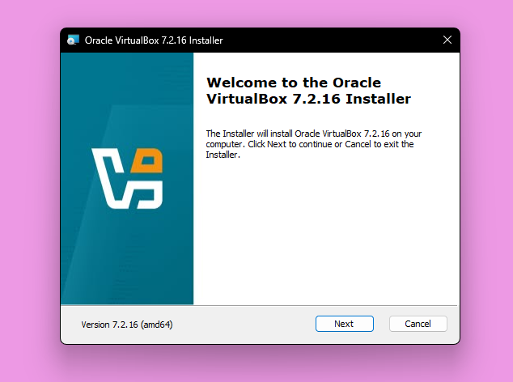

*Figure 1. Oracle VirtualBox 7.2.16 installer.*

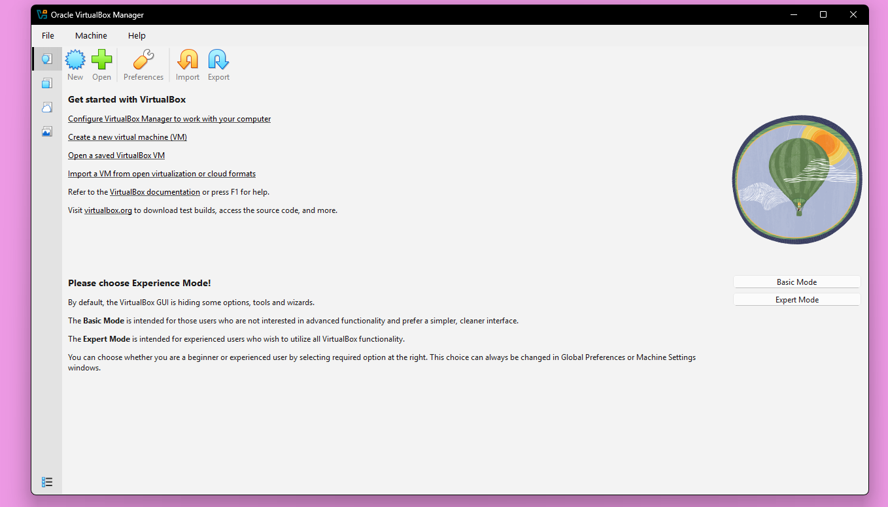

*Figure 2. VirtualBox Manager after installation.*

## Step 2 - Obtain the Windows Server Installation ISO

I used the Microsoft Evaluation Center to obtain Windows Server
installation media. The ISO file is attached to the virtual machine and
used like a virtual installation DVD.

**Procedure**

4.  Open the Microsoft Windows Server Evaluation Center.

5.  Choose the ISO download option.

6.  Complete any required evaluation registration fields.

7.  Download the 64-bit ISO to the host computer.

**Why this matters:** The ISO provides the bootable Windows Server
installer that will be used to build DC01.

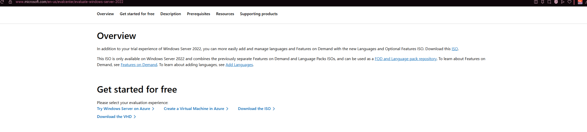

*Figure 3. Windows Server Evaluation Center overview and ISO download
option.*

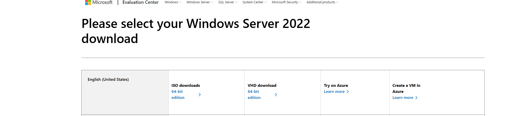

*Figure 4. 64-bit ISO download selection.*

## Step 3 - Create the DC01 Virtual Machine

Next, I created the server virtual machine that would become the domain
controller. I named the VM DC01 to match its planned role in the lab.

**Procedure**

8.  In VirtualBox Manager, select New.

9.  Enter DC01 as the VM name.

10. Attach the downloaded Windows Server ISO.

11. Continue to the hardware configuration page.

**Why this matters:** Using a descriptive hostname such as DC01 makes
the machine role immediately recognizable in an Active Directory
environment.

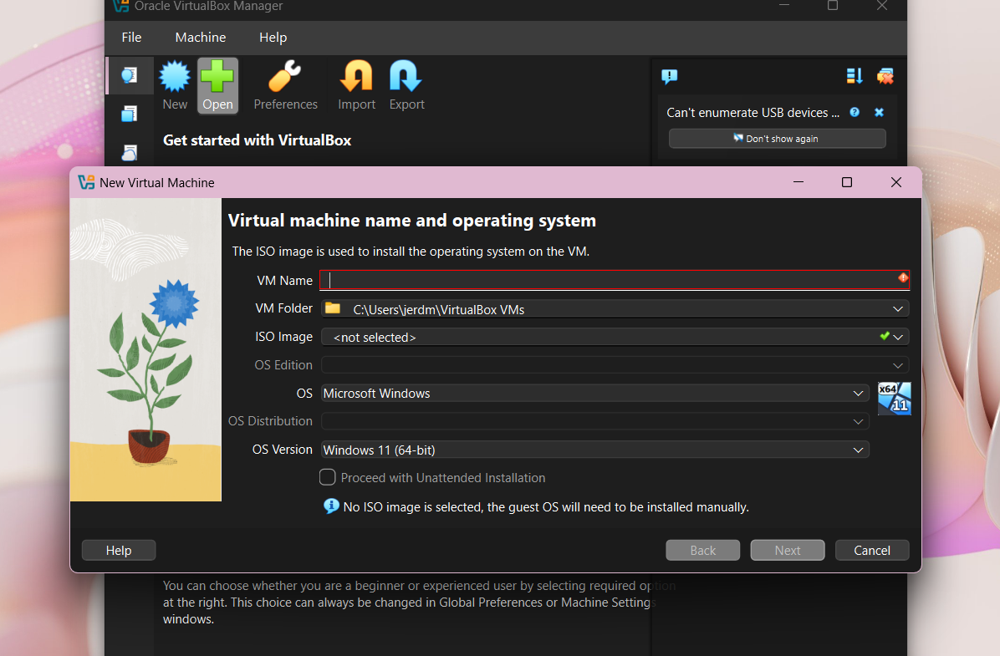

*Figure 5. New Virtual Machine wizard used to define the VM name and
installation media.*

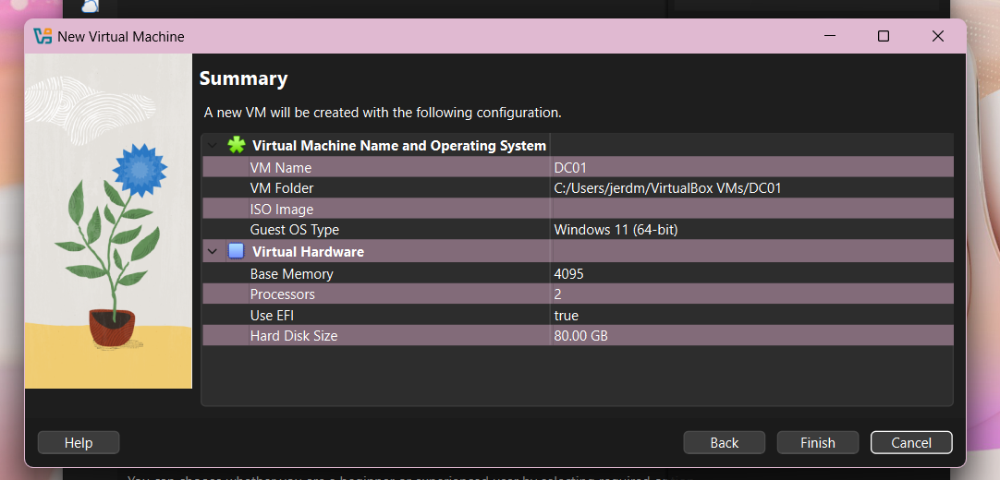

*Figure 6. VirtualBox VM summary showing DC01 before creation.*

## Step 4 - Allocate Virtual Hardware

I assigned enough virtual resources for Windows Server and Active
Directory to operate comfortably while keeping the lab lightweight.

**Procedure**

12. Set base memory to approximately 4 GB (4095 MB).

13. Assign 2 virtual CPUs.

14. Create an 80 GB virtual disk.

15. Leave EFI enabled as shown in the captured setup.

**Configuration used**

Base Memory: 4095 MB  
Processors: 2  
Virtual Disk: 80 GB

**Why this matters:** Active Directory itself is lightweight in a small
lab, but enough memory and disk space are needed for the operating
system, updates, DNS, and management tools.

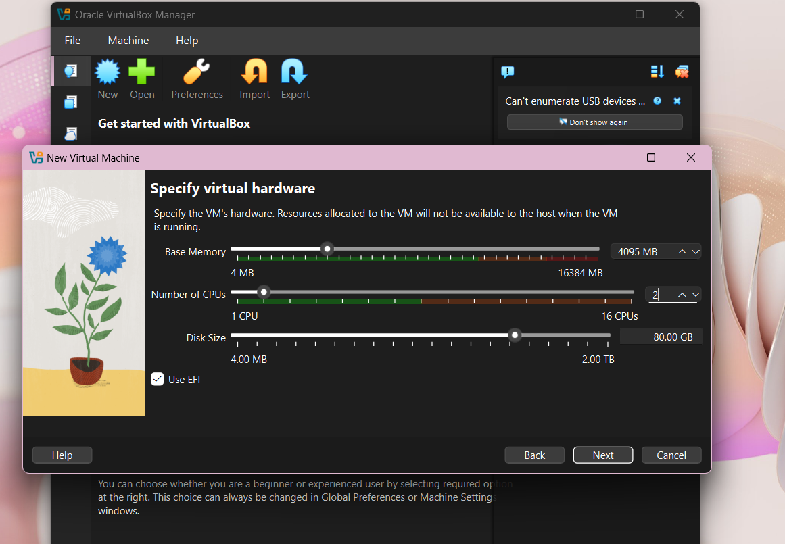

*Figure 7. DC01 hardware allocation: 4095 MB RAM, 2 CPUs, and 80 GB
disk.*

## Step 5 - Boot the VM and Install Windows Server

After creating DC01, I booted the VM from the attached Windows Server
ISO and started the operating-system installation.

**Procedure**

16. Start DC01 in VirtualBox.

17. At Windows Server Setup, confirm the language and regional settings.

18. Proceed through the Windows Server installation and create the local
    Administrator password.

19. After installation, rename the server to DC01 if the Windows
    installer assigned a temporary computer name, then restart.

**Why this matters:** The computer name is important because the same
server identity will appear later in Active Directory and DNS.

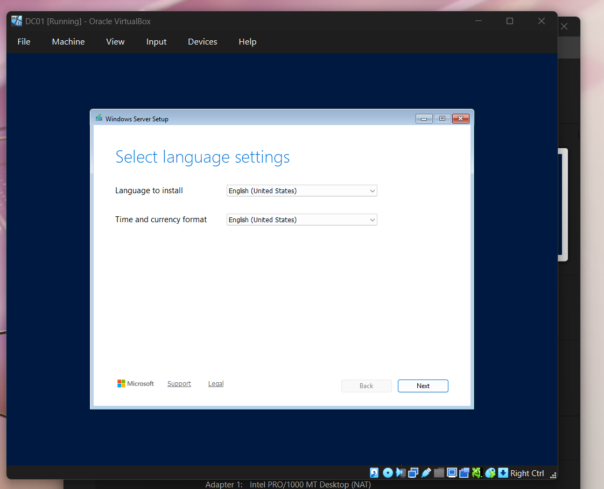

*Figure 8. Windows Server Setup language selection.*

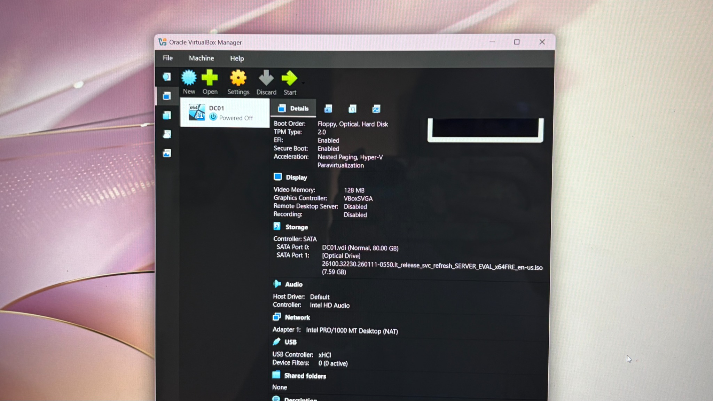

*Figure 9. DC01 powered off in VirtualBox with the server ISO attached
to the optical drive.*

## Step 6 - Prepare DC01 Virtual Networking

The server initially used the default VirtualBox NAT adapter. I then
adjusted the networking so that additional lab virtual machines could
later communicate with DC01 on the same virtual network.

**Procedure**

20. Shut down DC01 before changing the adapter configuration.

21. Open DC01 Settings \> Network.

22. Confirm Adapter 1 is enabled.

23. Change the adapter from the default NAT mode to a NAT Network after
    the lab NAT Network is created.

**Why this matters:** A shared NAT Network allows multiple virtual
machines to communicate with each other while still providing outbound
connectivity through the host.

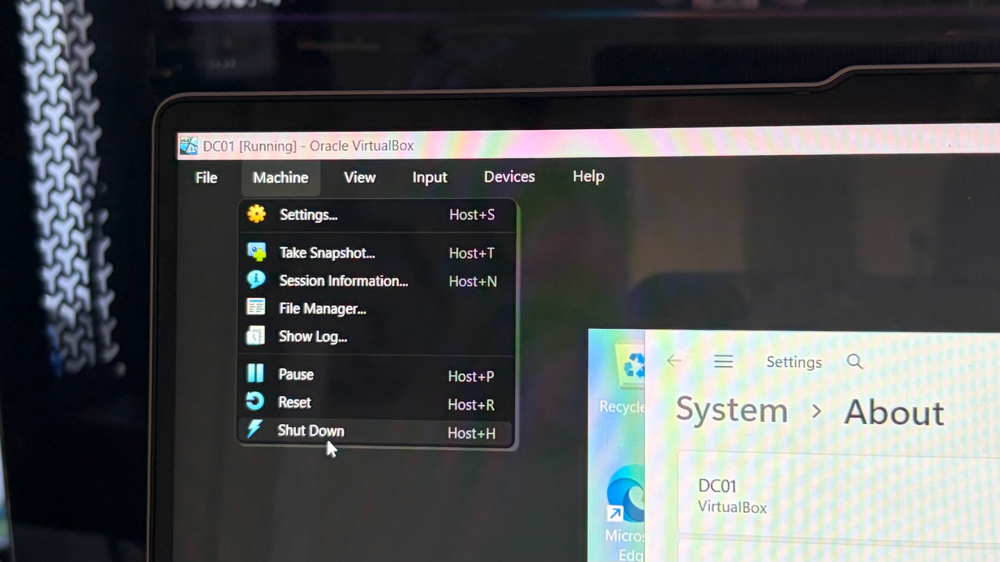

*Figure 10. Shutting down DC01 before changing VirtualBox networking.*

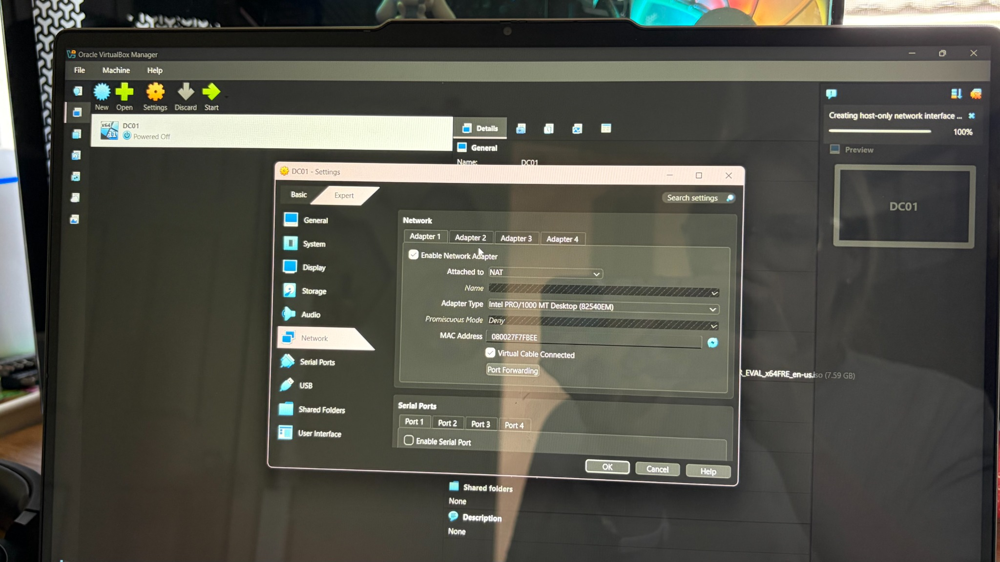

*Figure 11. DC01 Adapter 1 initially configured for standard NAT.*

## Step 7 - Create and Select the NAT Network

I opened the VirtualBox Network Manager and created a NAT Network. The
screenshots show the network listed as NatNetwork. Earlier lab notes
referred to this logical network as the home-lab network.

**Procedure**

24. Open the VirtualBox Network tool.

25. Select the NAT Networks tab.

26. Create a NAT Network.

27. Use the NAT Network for DC01 Adapter 1.

**Configuration used**

Network prefix observed later in the lab: 10.0.2.0/24  
DC01 IPv4 observed: 10.0.2.3  
Default gateway observed: 10.0.2.1

**Why this matters:** Unlike the per-VM default NAT mode, a NAT Network
can place multiple VMs on the same virtual segment so the future Windows
client can reach the domain controller.

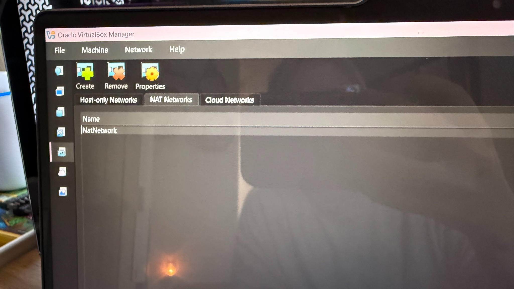

*Figure 12. VirtualBox Network Manager with the NAT Networks tab.*

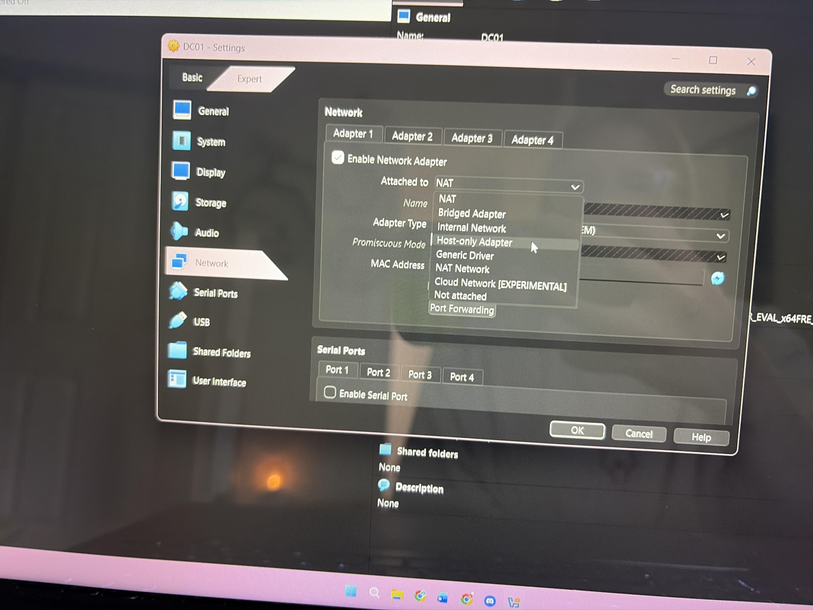

*Figure 13. Selecting NAT Network from the DC01 network adapter type
menu.*

## Step 8 - Verify Basic Network Connectivity

After starting DC01 on the NAT Network, I used Command Prompt to confirm
that the server had an IPv4 configuration and could reach both its
virtual gateway and an external IP address.

**Procedure**

28. Open Command Prompt on DC01.

29. Run ipconfig and record the IPv4 address and default gateway.

30. Ping 10.0.2.1 to test the VirtualBox gateway.

31. Ping 8.8.8.8 to test outbound IP connectivity.

**Configuration used**

ipconfig  
ping 10.0.2.1  
ping 8.8.8.8

**Why this matters:** Successful replies confirm that the server has
basic Layer 3 connectivity before Active Directory and DNS are
installed.

| **Note:** During the lab, DC01 reported IPv4 address 10.0.2.3 and default gateway 10.0.2.1, and both ping tests returned replies. |
|-----------------------------------------------------------------------------------------------------------------------------------|

## Step 9 - Install Active Directory Domain Services

With Windows Server and networking working, I installed the Active
Directory Domain Services server role through Server Manager.

**Procedure**

32. Open Server Manager.

33. Select Manage \> Add Roles and Features.

34. Choose Role-based or feature-based installation.

35. Select DC01 as the destination server.

36. Enable Active Directory Domain Services and add the required
    management features.

37. Complete the wizard and wait for the role installation to finish.

**Why this matters:** Installing the AD DS role adds the binaries and
management tools needed before a Windows Server can be promoted to a
domain controller.

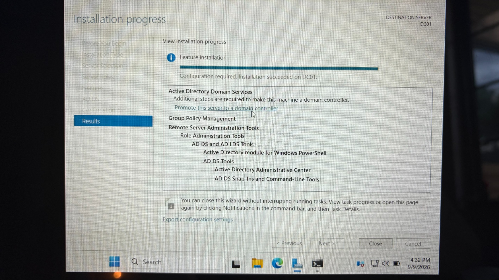

*Figure 14. AD DS role installation completed successfully; the server
is ready for promotion.*

## Step 10 - Create a New Forest and Domain

After AD DS installed, I selected the option to promote DC01 to a domain
controller. Because this was a new lab with no existing Active Directory
environment, I created a new forest.

**Procedure**

38. Click Promote this server to a domain controller.

39. Select Add a new forest.

40. Enter homelab.local as the root domain name.

41. Continue to Domain Controller Options.

**Configuration used**

Root domain name: homelab.local

**Why this matters:** A forest is the top-level Active Directory
structure. Creating a new forest also creates the first domain and
establishes DC01 as the first domain controller in that environment.

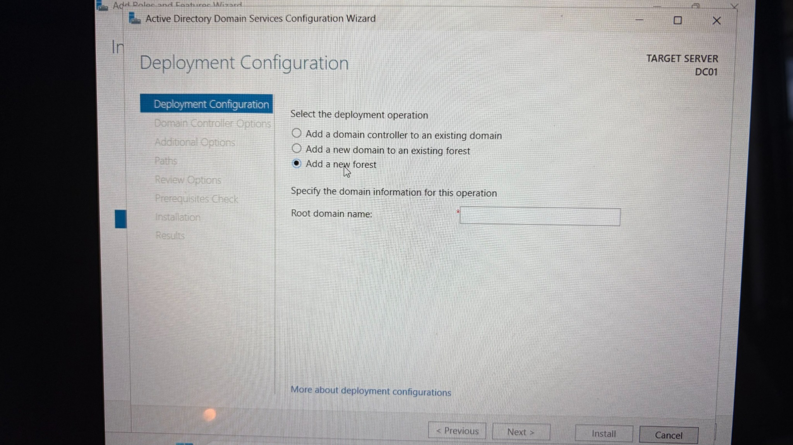

*Figure 15. Deployment Configuration screen with Add a new forest
selected.*

## Step 11 - Configure Domain Controller and DNS Options

I configured DC01 as a writable domain controller, DNS server, and
Global Catalog server. I also created a Directory Services Restore Mode
(DSRM) password.

**Procedure**

42. Leave the forest and domain functional levels at the values shown by
    the wizard.

43. Keep Domain Name System (DNS) server enabled.

44. Keep Global Catalog (GC) enabled.

45. Leave Read Only Domain Controller (RODC) unchecked.

46. Create and confirm a DSRM password.

47. On DNS Options, leave Create DNS delegation unchecked for this
    standalone lab.

**Configuration used**

Forest functional level shown: Windows Server 2025  
Domain functional level shown: Windows Server 2025  
DNS Server: Enabled  
Global Catalog: Enabled  
RODC: Disabled

**Why this matters:** DNS is essential to Active Directory because
domain members use DNS service records to locate domain controllers and
other AD services. The Global Catalog supports forest-wide directory
lookups.

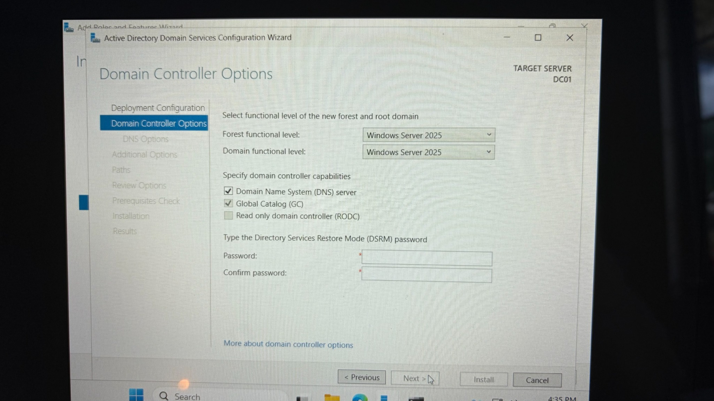

*Figure 16. Domain Controller Options showing DNS and Global Catalog
enabled.*

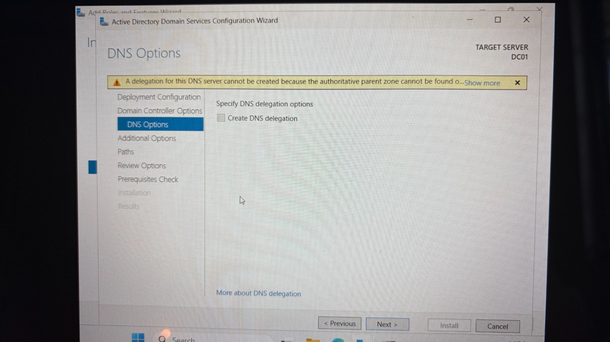

*Figure 17. DNS Options screen with the expected delegation warning.*

## Step 12 - Confirm NetBIOS Name and Active Directory Paths

The configuration wizard automatically generated the NetBIOS name
HOMELAB. I kept the default Active Directory database, log, and SYSVOL
locations.

**Procedure**

48. Confirm the NetBIOS domain name is HOMELAB.

49. Continue to Paths.

50. Leave the NTDS database and log files in C:\Windows\NTDS.

51. Leave SYSVOL in C:\Windows\SYSVOL.

**Configuration used**

NetBIOS domain name: HOMELAB  
Database: C:\Windows\NTDS  
Logs: C:\Windows\NTDS  
SYSVOL: C:\Windows\SYSVOL

**Why this matters:** The NetBIOS name provides the short form of the
domain name, such as HOMELAB\Administrator. Default AD paths are
appropriate for a small single-disk lab.

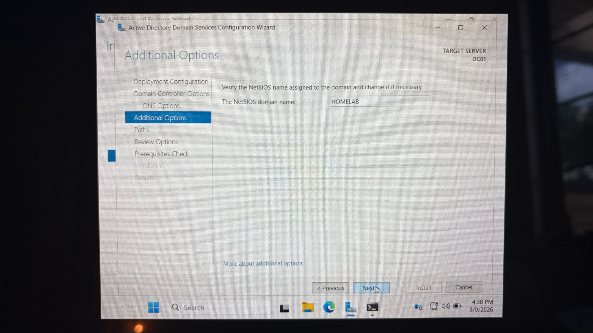

*Figure 18. Additional Options showing NetBIOS domain name HOMELAB.*

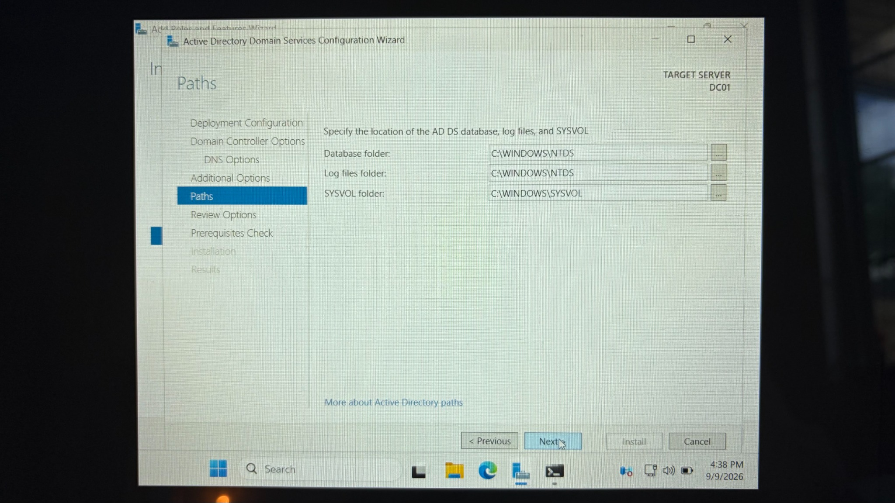

*Figure 19. Default AD DS database, log, and SYSVOL paths.*

## Step 13 - Review the Configuration and Run Prerequisite Checks

Before installation, I reviewed the domain configuration and allowed the
wizard to run prerequisite validation.

**Procedure**

52. Review the forest name, domain name, NetBIOS name, DNS setting, and
    Global Catalog setting.

53. Select Next to run prerequisite checks.

54. Confirm the green status message that all prerequisite checks passed
    successfully.

55. Review any warnings before selecting Install.

**Why this matters:** The prerequisite stage helps identify
configuration problems before the server is promoted. This screenshot
also documents an important networking warning that should be addressed
in a more production-like build.

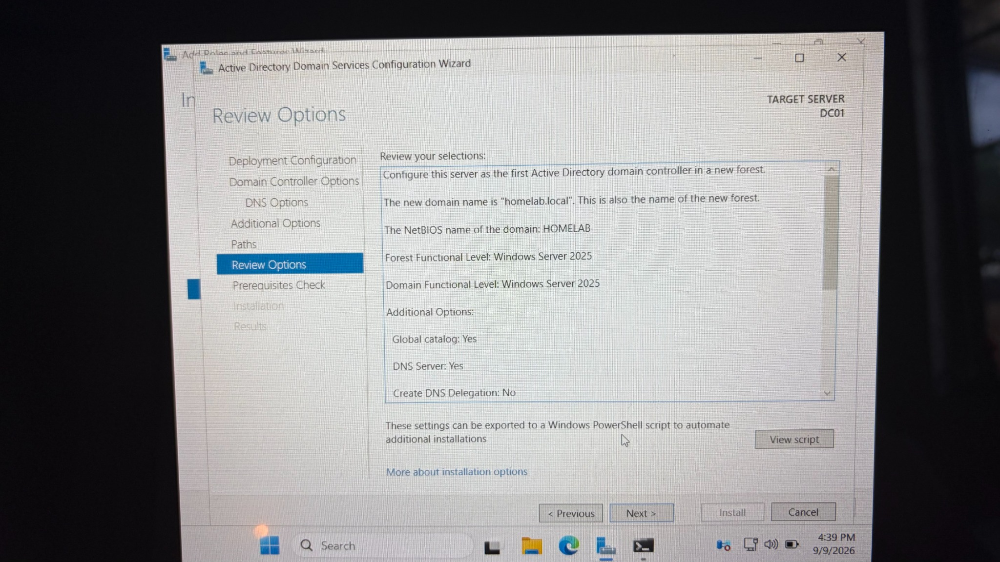

*Figure 20. Review Options confirms homelab.local, HOMELAB, DNS, and
Global Catalog.*

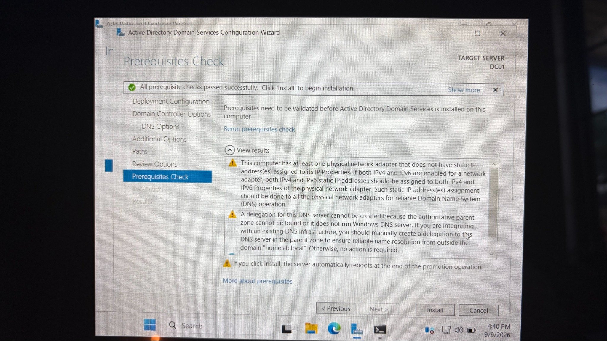

*Figure 21. Prerequisite checks passed, with warnings displayed for
review.*

> **Important:** The prerequisite screen warns that a network adapter does not have a static IP address. The lab still passed and continued, but a domain controller should normally use a stable/static IP address. For the next phase of this project, assign DC01 a predictable address and ensure domain clients use DC01 for DNS.

## Step 14 - Promote DC01 and Restart

After the checks passed, I installed the Active Directory configuration.
Windows Server successfully promoted DC01 to a domain controller and
then restarted automatically.

**Procedure**

56. Click Install from the Prerequisites Check page.

57. Wait while the promotion completes.

58. Allow Windows Server to restart automatically.

59. At the login screen, sign in using the domain Administrator account.

**Why this matters:** A successful promotion creates the Active
Directory database and SYSVOL, configures the DNS integration, and
changes the server from a standalone server into a domain controller.

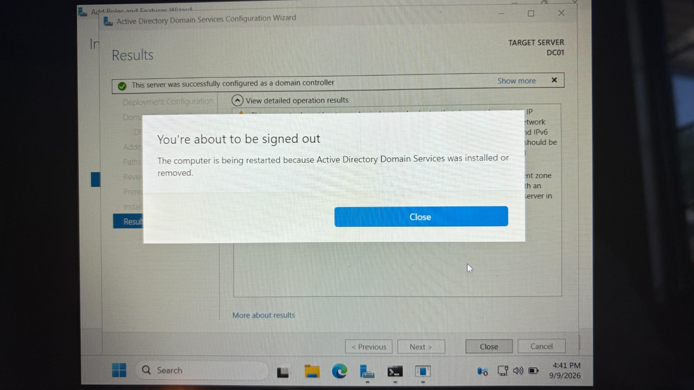

*Figure 22. Successful domain controller configuration and automatic
restart notification.*

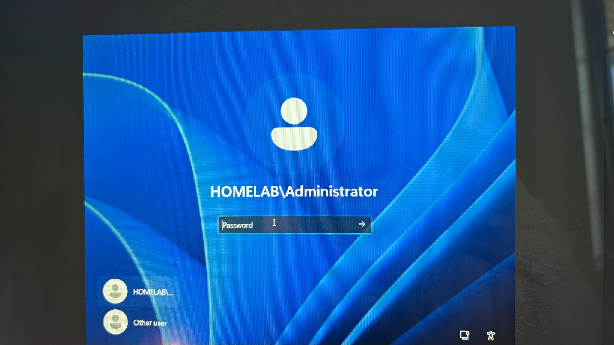

*Figure 23. Post-promotion login screen showing HOMELAB\Administrator.*

## Step 15 - Verify Active Directory

After the reboot, I used Server Manager and Active Directory Users and
Computers (ADUC) to verify that the domain had been created and that the
AD DS management tools were available.

**Procedure**

60. Open Server Manager.

61. Open Tools \> Active Directory Users and Computers.

62. Confirm that homelab.local appears in the console tree.

63. Expand the domain and verify the standard Active Directory
    containers and the Domain Controllers organizational unit.

64. Optionally open DNS Manager and use nslookup or ping to continue
    validating name resolution.

**Configuration used**

dsa.msc  
nslookup homelab.local  
ping DC01

**Why this matters:** Verification proves that the role installation and
domain controller promotion completed successfully and that the domain
is available for later user, group, OU, client-join, and Group Policy
work.

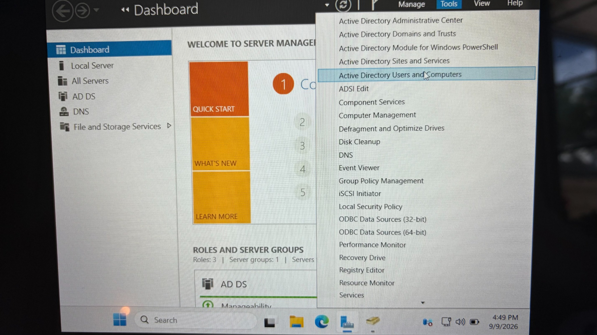

*Figure 24. Server Manager Tools menu showing Active Directory Users and
Computers.*

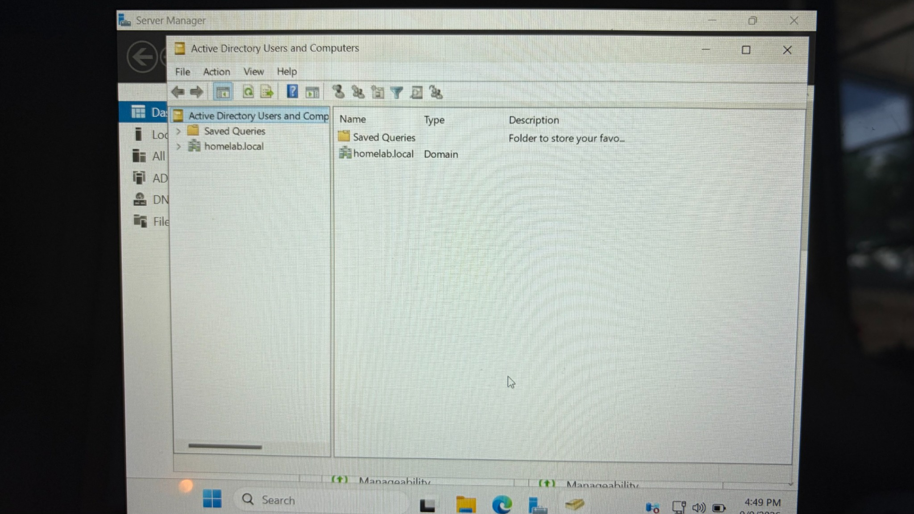

*Figure 25. Active Directory Users and Computers showing the
homelab.local domain.*

# Testing and Verification

The following checks were used or planned to confirm that the
environment was functioning correctly after the domain controller
promotion.

| **Test**                   | **Tool / Command**                   | **Expected Result**                    | **Lab Result**                         |
|----------------------------|--------------------------------------|----------------------------------------|----------------------------------------|
| Gateway connectivity       | ping 10.0.2.1                        | Replies from virtual gateway           | Successful                             |
| Outbound IP connectivity   | ping 8.8.8.8                         | Replies from external IP               | Successful                             |
| Domain presence            | Active Directory Users and Computers | homelab.local visible                  | Successful                             |
| Domain administrator login | Windows sign-in                      | HOMELAB\Administrator available        | Successful                             |
| DNS/domain resolution      | nslookup homelab.local               | Domain resolves through lab DNS        | Verify/retain screenshot in next phase |
| DC hostname resolution     | ping DC01                            | DC01 resolves to the domain controller | Verify/retain screenshot in next phase |

# Troubleshooting and Lessons Learned

## 1. Initial VM boot / installation media issue

During the early VM setup, the server did not immediately boot into the
installer. The troubleshooting process involved checking that the
Windows Server ISO was attached to the VM optical drive and confirming
the VM boot configuration. Once the installation media was correctly
available to DC01, Windows Server Setup started successfully.

## 2. VirtualBox network-mode confusion

The VirtualBox interface initially made it unclear whether Host-Only
Adapter, standard NAT, or NAT Network was the correct choice. The final
design used a NAT Network so DC01 could retain outbound connectivity
while also being reachable by future lab VMs on the same virtual
segment.

## 3. Dynamic IP warning during domain promotion

The Active Directory prerequisite check passed but warned that a network
adapter did not have a static IP address. This is an important lesson:
even when a small lab works using a DHCP-provided address, domain
controllers should normally use stable addressing because DNS and domain
clients depend on being able to locate the server consistently.

## 4. DNS delegation warning

The AD DS wizard displayed a DNS delegation warning because this was the
first DNS server and domain controller in a standalone new forest. No
parent Windows DNS zone existed to create a delegation, so the warning
was expected in this lab design.

# Skills Demonstrated

- Virtual machine creation and resource allocation

- Windows Server installation and basic server configuration

- VirtualBox NAT and NAT Network configuration

- IPv4 connectivity testing and troubleshooting

- Windows Server role installation with Server Manager

- Active Directory Domain Services deployment

- New forest and domain creation

- DNS and Global Catalog configuration

- Directory Services Restore Mode configuration

- NetBIOS naming and AD DS database/SYSVOL path review

- Domain controller promotion

- Active Directory verification using ADUC

- Technical documentation using screenshots and repeatable procedures

# Project Result

This phase of the home lab successfully produced a functioning Active
Directory environment with DC01 acting as the first domain controller
for homelab.local. The server has AD DS and DNS installed, the HOMELAB
domain identity is active, and the domain is visible in Active Directory
Users and Computers. The environment is now ready to be expanded with
organizational units, users, security groups, a Windows client VM,
domain joining, Group Policy, and additional troubleshooting
demonstrations.
